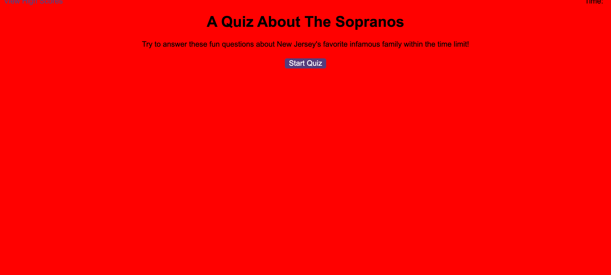

# A-Quiz-About-The-Sopranos
Project Name: A Quiz About The Sopranos

Technologies Used: JavaScript (through Web-APIs)

Description: The goal of this assignment was to create a quiz where a user would answer trivia questions. If the user got the answer wrong the score/time would have ten seconds (and therefore points) deducted. At the end the user would enter their initials and that would be stored in local storage. 

Known Bugs:
N/A

URLs:[A Quiz About The Sopranos](https://natpitt2393.github.io/A-Quiz-About-The-Sopranos/)

[napitt2393/A-Quiz-About-The-Sopranos](https://github.com/natpitt2393/A-Quiz-About-The-Sopranos)
      

Screenshot of website: 	

